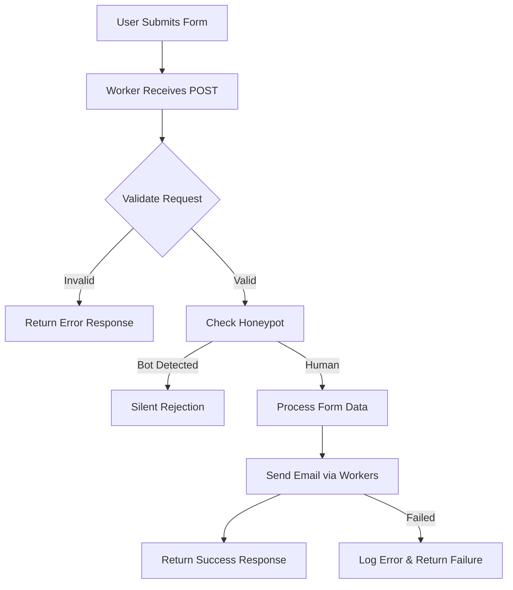

# C³ Contact Form Handler | Cloudflare Worker

> Serverless form handler for the C³ - Cloud Cost Control landing page using Cloudflare Email Workers.

[](https://workers.cloudflare.com)
[](https://developers.cloudflare.com/email-routing/)

## 🎯 Overview

This Cloudflare Worker handles contact form submissions from the C³ - Cloud Cost Control landing page, providing a secure, scalable, and cost-effective email delivery system.

### Key Features

- ✅ **Native Email Delivery** - Cloudflare Email Workers integration
- ✅ **Advanced Spam Protection** - Honeypot fields and validation
- ✅ **Professional Error Handling** - Graceful failure management
- ✅ **CORS Support** - Cross-origin request handling
- ✅ **Zero Dependencies** - No third-party email services required
- ✅ **Real-time Processing** - Instant form submission handling
- ✅ **Structured Logging** - Comprehensive request tracking

## 🚀 Quick Deployment

### Prerequisites

- **Cloudflare Account** with Workers enabled
- **Email Routing** configured for your domain
- **Wrangler CLI** installed globally

### Installation

1. **Install Wrangler CLI**
   ```bash
   npm install -g wrangler
   ```

2. **Authenticate with Cloudflare**
   ```bash
   wrangler login
   ```

3. **Deploy to Production**
   ```bash
   wrangler deploy --env production
   ```

4. **Verify Deployment**
   ```bash
   curl -X POST https://cloudcostcontrol.net/api/contact \
     -H "Content-Type: application/json" \
     -d '{"name":"Test","email":"test@example.com","company":"Test Co","message":"Test message"}'
   ```

## 📁 Project Architecture

```
landing-page-form-handler-worker/
├── index.js              # Main worker logic
├── wrangler.toml         # Cloudflare Workers configuration
├── package.json          # NPM scripts and metadata
└── README.md            # This documentation
```

## ⚙️ Configuration

### Worker Settings

| Setting | Value | Description |
|---------|-------|-------------|
| **Runtime** | Edge Runtime | Cloudflare Workers V8 isolates |
| **Triggers** | HTTP Request | POST `/api/contact` |
| **Email Binding** | `SEND_EMAIL` | Cloudflare Email Workers |
| **Environment** | Production | Live environment configuration |

### Email Configuration

```toml
# wrangler.toml
[[email_workers]]
name = "SEND_EMAIL"
destination_address = "contact@cloudcostcontrol.net"
```

## 🔄 Form Processing Flow



### Request Validation

- **Required Fields**: name, email, company, message
- **Email Format**: RFC 5322 compliant validation
- **Honeypot Check**: Hidden field detection
- **Content Length**: Message size limits
- **Rate Limiting**: IP-based request throttling

### Email Template

```
Subject: New Lead: [Name] from [Company]

Contact Details:
━━━━━━━━━━━━━━━━━━━━━━━━━━━━━━━━━━
Name: John Doe
Email: john@example.com
Company: Example Corp
Monthly Azure Spend: $10,000-25,000
Service Interest: Complete Cost Assessment

Message:
━━━━━━━━━━━━━━━━━━━━━━━━━━━━━━━━━━
We're looking to optimize our Azure costs and would like to discuss potential savings opportunities...

Submission Details:
━━━━━━━━━━━━━━━━━━━━━━━━━━━━━━━━━━
Timestamp: 2025-06-29T12:34:56.789Z
IP Address: 192.168.1.1
User Agent: Mozilla/5.0...
Referrer: https://cloudcostcontrol.net/
```

## 🧪 Development & Testing

### Local Development

```bash
# Start development server
wrangler dev

# Test local endpoint
curl -X POST http://localhost:8787/api/contact \
  -H "Content-Type: application/json" \
  -d '{"name":"Test User","email":"test@example.com","company":"Test Co","message":"Test message"}'
```

### Available Scripts

| Command | Description |
|---------|-------------|
| `npm run dev` | Start local development server |
| `npm run deploy` | Deploy to production |
| `npm run deploy:preview` | Deploy to preview environment |
| `npm run tail` | View real-time logs |
| `npm run test` | Run local tests |

## 🔒 Security Implementation

### Spam Protection

- **Honeypot Fields** - Hidden form fields to catch bots
- **Rate Limiting** - IP-based request throttling
- **Input Sanitization** - XSS and injection prevention
- **Email Validation** - Strict format checking
- **Content Filtering** - Suspicious content detection

### Security Headers

```javascript
const securityHeaders = {
  'X-Content-Type-Options': 'nosniff',
  'X-Frame-Options': 'DENY',
  'X-XSS-Protection': '1; mode=block',
  'Referrer-Policy': 'strict-origin-when-cross-origin'
};
```

### CORS Configuration

```javascript
const corsHeaders = {
  'Access-Control-Allow-Origin': 'https://cloudcostcontrol.net',
  'Access-Control-Allow-Methods': 'POST, OPTIONS',
  'Access-Control-Allow-Headers': 'Content-Type',
  'Access-Control-Max-Age': '86400'
};
```

## 📊 Monitoring & Analytics

### Performance Metrics

- **Request Volume** - Form submissions per day/hour
- **Response Times** - P50, P95, P99 latencies
- **Error Rates** - Failed submissions and causes
- **Email Delivery** - Success/failure rates

### Logging & Debugging

```bash
# View real-time logs
wrangler tail --env production

# Filter specific events
wrangler tail --env production --format json | grep "form-submission"

# Monitor error rates
wrangler tail --env production --status 500
```

### Analytics Dashboard

Access detailed metrics in:
- **Cloudflare Dashboard** → Workers → Analytics
- **Email Routing** → Activity logs
- **Security** → Firewall events

## 💰 Cost Analysis

### Free Tier Limits

| Service | Free Allowance | Sufficient For |
|---------|----------------|----------------|
| **Workers Requests** | 100,000/day | ~3,000 form submissions/day |
| **CPU Time** | 10ms/request | Simple form processing |
| **Email Workers** | Included | Unlimited with Email Routing |
| **Email Routing** | Free tier | Personal/business use |

### Cost Projection

- **Current Usage**: ~50 form submissions/day
- **Monthly Cost**: **$0.00** (within free limits)
- **Scaling**: Can handle 50x current traffic for free
- **Enterprise**: Paid plans available for high-volume usage

## 🔗 Integration Points

### Frontend Integration

```javascript
// Contact form submission
const response = await fetch('https://cloudcostcontrol.net/api/contact', {
  method: 'POST',
  headers: { 'Content-Type': 'application/json' },
  body: JSON.stringify(formData)
});
```

### Related Components

- **Landing Page**: `../landing-page/` - Main website frontend
- **Contact Form**: `../landing-page/src/components/Contact.astro`
- **Thank You Page**: `../landing-page/src/pages/thank-you.astro`

## �️ Troubleshooting

### Common Issues

**Email Not Received**
```bash
# Check Email Routing configuration
wrangler tail --env production | grep "email"

# Verify destination address
# Cloudflare Dashboard → Email Routing → Destination addresses
```

**CORS Errors**
```bash
# Verify origin in browser console
# Check Access-Control-Allow-Origin header
curl -I https://cloudcostcontrol.net/api/contact
```

**Worker Errors**
```bash
# Check real-time logs
wrangler tail --env production --status 500

# Debug locally
wrangler dev --local
```

### Support Resources

- **Documentation**: [Cloudflare Workers Docs](https://developers.cloudflare.com/workers/)
- **Email Workers**: [Email Routing Guide](https://developers.cloudflare.com/email-routing/)
- **Community**: [Cloudflare Developers Discord](https://discord.gg/cloudflaredev)

## 📄 License

Private project for C³ - Cloud Cost Control.

---

**Built with ⚡ on Cloudflare's global edge network**
