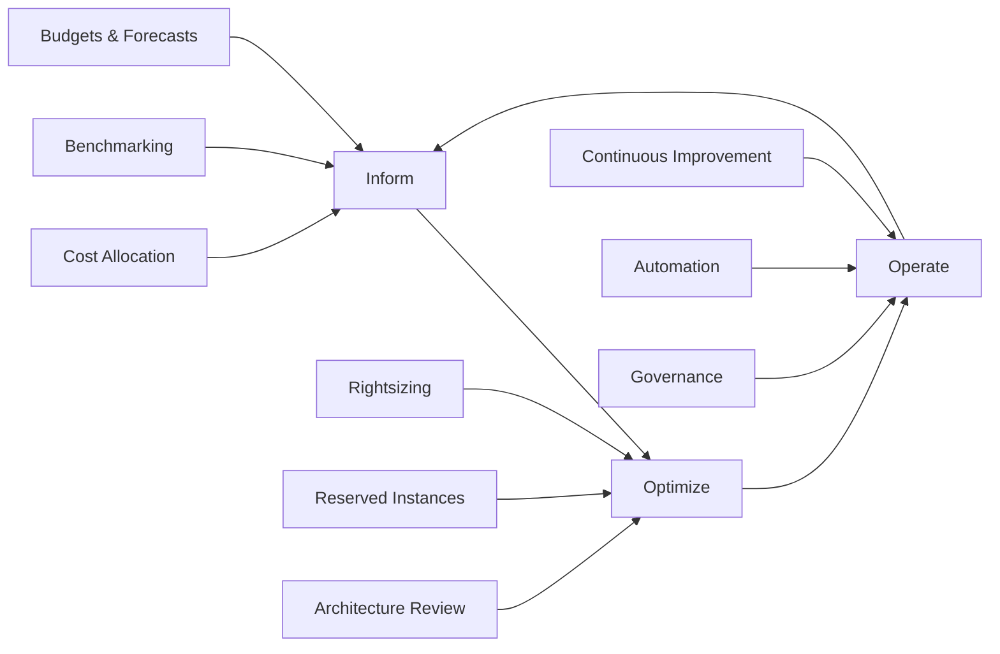

# FinOps Fundamentals: Building a World-Class Cloud Financial Operations Practice

FinOps (Financial Operations) has evolved from a buzzword to a critical business discipline. This comprehensive guide provides everything you need to build a successful FinOps practice that drives cost optimization, operational efficiency, and business value from cloud investments.

## What is FinOps? Understanding the Fundamentals

### Definition and Core Principles

**FinOps** is an operational framework and cultural practice that brings financial accountability to the variable spend model of cloud computing. It enables distributed teams to make business trade-offs between speed, cost, and quality.

### The Six FinOps Principles

1. **Teams need to collaborate** - Finance, Engineering, and Business working together
2. **Everyone takes ownership for their cloud usage** - Shared responsibility model
3. **A centralized team drives FinOps** - Center of Excellence approach
4. **Reports should be accessible and timely** - Real-time visibility and actionable insights
5. **Decisions are driven by business value** - Cost optimization aligned with business outcomes
6. **Take advantage of the variable cost model of the cloud** - Embrace elasticity and pay-as-you-go

### FinOps Lifecycle



## Building Your FinOps Organization

### 1. FinOps Team Structure

```yaml
finops_organization_structure:
  finops_center_of_excellence:
    head_of_finops:
      responsibilities:
        - strategic_vision_and_direction
        - executive_stakeholder_management
        - cross_functional_team_leadership
        - roi_demonstration
      
    finops_practitioners:
      senior_finops_engineer:
        responsibilities:
          - advanced_cost_optimization
          - automation_development
          - tool_integration
          - technical_mentoring
        skills_required:
          - cloud_platforms_expertise
          - programming_scripting
          - data_analysis
          - cost_management_tools
      
      finops_analyst:
        responsibilities:
          - cost_reporting_analysis
          - budget_forecasting
          - variance_analysis
          - stakeholder_communication
        skills_required:
          - financial_analysis
          - data_visualization
          - cloud_cost_tools
          - business_acumen
      
      finops_program_manager:
        responsibilities:
          - project_coordination
          - process_improvement
          - training_programs
          - governance_implementation
        skills_required:
          - project_management
          - change_management
          - process_design
          - stakeholder_management

  engineering_teams:
    cloud_engineers:
      finops_responsibilities:
        - resource_rightsizing
        - architecture_optimization
        - cost_aware_development
        - automated_cleanup
    
    product_teams:
      finops_responsibilities:
        - feature_cost_awareness
        - resource_ownership
        - cost_impact_assessment
        - optimization_prioritization

  finance_team:
    cloud_financial_analyst:
      responsibilities:
        - budget_management
        - chargeback_showback
        - financial_reporting
        - vendor_management
    
    procurement:
      responsibilities:
        - contract_negotiation
        - reserved_instance_purchasing
        - vendor_relationship_management
        - compliance_oversight

  business_stakeholders:
    product_owners:
      responsibilities:
        - cost_vs_feature_decisions
        - budget_accountability
        - roi_optimization
        
    executives:
      responsibilities:
        - strategic_direction
        - investment_decisions
        - cultural_change_sponsorship
```

### 2. FinOps Maturity Assessment Framework

```python
# FinOps Maturity Assessment Tool
class FinOpsMaturityAssessment:
    def __init__(self):
        self.domains = {
            'inform': {
                'cost_allocation': {
                    'crawl': 'Basic tagging in place, manual cost allocation',
                    'walk': 'Automated cost allocation, shared costs distributed',
                    'run': 'Real-time cost allocation with business unit mapping'
                },
                'data_analysis': {
                    'crawl': 'Basic cost reports, monthly reviews',
                    'walk': 'Automated reporting, trend analysis, forecasting',
                    'run': 'Predictive analytics, AI-driven insights, real-time optimization'
                },
                'showback_chargeback': {
                    'crawl': 'Basic cost visibility to teams',
                    'walk': 'Detailed showback reports with accountability',
                    'run': 'Automated chargeback with cost center integration'
                }
            },
            'optimize': {
                'rate_optimization': {
                    'crawl': 'Basic reserved instance purchases',
                    'walk': 'Strategic RI/SP planning, regular optimization',
                    'run': 'Automated commitment management, dynamic optimization'
                },
                'usage_optimization': {
                    'crawl': 'Manual rightsizing recommendations',
                    'walk': 'Automated rightsizing, scheduled resources',
                    'run': 'AI-driven optimization, auto-scaling, predictive scaling'
                },
                'architecture_optimization': {
                    'crawl': 'Ad-hoc architecture reviews',
                    'walk': 'Regular architecture assessments, cost-aware design',
                    'run': 'Cost-optimized architecture patterns, real-time optimization'
                }
            },
            'operate': {
                'continuous_improvement': {
                    'crawl': 'Quarterly optimization reviews',
                    'walk': 'Monthly optimization cycles, KPI tracking',
                    'run': 'Continuous optimization, automated remediation'
                },
                'cloud_policy_governance': {
                    'crawl': 'Basic resource policies',
                    'walk': 'Comprehensive governance framework',
                    'run': 'Intelligent policy enforcement, self-healing systems'
                },
                'anomaly_detection': {
                    'crawl': 'Manual cost spike identification',
                    'walk': 'Automated anomaly alerts',
                    'run': 'AI-powered anomaly detection with auto-remediation'
                }
            }
        }
        
    def assess_maturity(self, organization_responses):
        """Assess FinOps maturity based on organization responses"""
        
        maturity_scores = {}
        overall_scores = {'crawl': 0, 'walk': 0, 'run': 0}
        
        for domain, capabilities in self.domains.items():
            domain_scores = {'crawl': 0, 'walk': 0, 'run': 0}
            
            for capability, levels in capabilities.items():
                user_level = organization_responses.get(f"{domain}_{capability}", 'crawl')
                domain_scores[user_level] += 1
            
            # Calculate domain maturity level
            total_capabilities = len(capabilities)
            if domain_scores['run'] / total_capabilities >= 0.7:
                domain_maturity = 'run'
            elif domain_scores['walk'] / total_capabilities >= 0.7:
                domain_maturity = 'walk'
            else:
                domain_maturity = 'crawl'
            
            maturity_scores[domain] = {
                'level': domain_maturity,
                'scores': domain_scores,
                'recommendations': self.get_domain_recommendations(domain, domain_maturity)
            }
            
            # Add to overall scores
            for level, count in domain_scores.items():
                overall_scores[level] += count
        
        # Calculate overall maturity
        total_assessments = sum(overall_scores.values())
        if overall_scores['run'] / total_assessments >= 0.6:
            overall_maturity = 'run'
        elif overall_scores['walk'] / total_assessments >= 0.5:
            overall_maturity = 'walk'
        else:
            overall_maturity = 'crawl'
        
        return {
            'overall_maturity': overall_maturity,
            'domain_maturity': maturity_scores,
            'improvement_roadmap': self.generate_improvement_roadmap(maturity_scores),
            'priority_actions': self.identify_priority_actions(maturity_scores)
        }
    
    def get_domain_recommendations(self, domain, current_level):
        """Get specific recommendations for domain improvement"""
        
        recommendations = {
            'inform': {
                'crawl': [
                    "Implement comprehensive resource tagging strategy",
                    "Set up automated cost reporting dashboards",
                    "Establish regular cost review meetings"
                ],
                'walk': [
                    "Implement real-time cost monitoring",
                    "Develop predictive cost modeling",
                    "Create business unit cost allocation automation"
                ],
                'run': [
                    "Implement AI-driven cost optimization recommendations",
                    "Develop real-time business impact correlation",
                    "Create self-service cost analytics platform"
                ]
            },
            'optimize': {
                'crawl': [
                    "Implement basic rightsizing program",
                    "Establish reserved instance purchasing process",
                    "Create resource cleanup automation"
                ],
                'walk': [
                    "Implement intelligent commitment management",
                    "Develop advanced auto-scaling strategies",
                    "Create cost-optimized architecture guidelines"
                ],
                'run': [
                    "Implement AI-driven workload optimization",
                    "Develop real-time cost-performance optimization",
                    "Create autonomous cost management systems"
                ]
            },
            'operate': {
                'crawl': [
                    "Establish FinOps center of excellence",
                    "Implement basic governance policies",
                    "Create cost optimization KPIs"
                ],
                'walk': [
                    "Develop advanced governance automation",
                    "Implement continuous optimization processes",
                    "Create comprehensive FinOps training programs"
                ],
                'run': [
                    "Implement intelligent policy enforcement",
                    "Develop self-healing cost management",
                    "Create FinOps-as-a-Service capabilities"
                ]
            }
        }
        
        return recommendations.get(domain, {}).get(current_level, [])
    
    def generate_improvement_roadmap(self, maturity_scores):
        """Generate 90-day improvement roadmap"""
        
        roadmap = {
            '0-30_days': [],
            '30-60_days': [],
            '60-90_days': []
        }
        
        # Prioritize crawl-level domains for immediate improvement
        crawl_domains = [domain for domain, info in maturity_scores.items() if info['level'] == 'crawl']
        
        if crawl_domains:
            roadmap['0-30_days'] = [
                f"Focus on {crawl_domains[0]} domain foundational improvements",
                "Implement basic cost visibility and reporting",
                "Establish regular cost review processes"
            ]
            
        # Walk-level improvements for month 2
        walk_domains = [domain for domain, info in maturity_scores.items() if info['level'] == 'walk']
        
        roadmap['30-60_days'] = [
            "Implement automated cost optimization processes",
            "Develop advanced reporting and analytics",
            "Establish cross-functional FinOps workflows"
        ]
        
        # Run-level aspirational improvements for month 3
        roadmap['60-90_days'] = [
            "Implement AI-driven optimization capabilities",
            "Develop real-time cost management systems",
            "Create autonomous optimization processes"
        ]
        
        return roadmap

# Example usage
assessment = FinOpsMaturityAssessment()

# Sample organization responses
org_responses = {
    'inform_cost_allocation': 'walk',
    'inform_data_analysis': 'crawl',
    'inform_showback_chargeback': 'crawl',
    'optimize_rate_optimization': 'walk',
    'optimize_usage_optimization': 'crawl',
    'optimize_architecture_optimization': 'crawl',
    'operate_continuous_improvement': 'crawl',
    'operate_cloud_policy_governance': 'walk',
    'operate_anomaly_detection': 'crawl'
}

results = assessment.assess_maturity(org_responses)
print(f"Overall FinOps Maturity: {results['overall_maturity']}")
```

### 3. FinOps Implementation Roadmap

```yaml
# 12-month FinOps implementation roadmap
finops_implementation_roadmap:
  phase_1_foundation:
    duration: "Months 1-3"
    objectives:
      - establish_finops_team
      - implement_basic_cost_visibility
      - create_governance_framework
      
    key_deliverables:
      - finops_team_charter
      - cost_allocation_strategy
      - basic_dashboards_reporting
      - initial_governance_policies
      
    success_metrics:
      - "100% resources tagged with cost allocation tags"
      - "Monthly cost reports delivered to all teams"
      - "Basic cost anomaly detection implemented"
      
  phase_2_optimization:
    duration: "Months 4-6"
    objectives:
      - implement_automated_optimization
      - develop_showback_capabilities
      - establish_optimization_processes
      
    key_deliverables:
      - automated_rightsizing_program
      - reserved_instance_strategy
      - showback_reporting_system
      - optimization_workflow_automation
      
    success_metrics:
      - "15% cost reduction through optimization"
      - "80% of teams actively managing their costs"
      - "Automated optimization covering 60% of resources"
      
  phase_3_advanced_operations:
    duration: "Months 7-9"
    objectives:
      - implement_advanced_analytics
      - develop_predictive_capabilities
      - create_chargeback_mechanisms
      
    key_deliverables:
      - predictive_cost_modeling
      - advanced_analytics_platform
      - chargeback_automation
      - cost_optimization_ai
      
    success_metrics:
      - "Forecast accuracy within 5%"
      - "Real-time cost optimization implemented"
      - "Full chargeback implementation"
      
  phase_4_innovation:
    duration: "Months 10-12"
    objectives:
      - implement_ai_driven_optimization
      - develop_autonomous_operations
      - create_finops_center_of_excellence
      
    key_deliverables:
      - ai_cost_optimization_platform
      - autonomous_cost_management
      - finops_training_certification
      - continuous_improvement_processes
      
    success_metrics:
      - "30% overall cost optimization achieved"
      - "95% automated cost management"
      - "FinOps maturity level: Run"
```

## Essential FinOps Tools and Technologies

### 1. Cost Management Platform Stack

```python
# FinOps toolchain integration framework
class FinOpsToolchain:
    def __init__(self):
        self.tools = {
            'cost_management': {
                'native_cloud_tools': ['Azure Cost Management', 'AWS Cost Explorer', 'GCP Billing'],
                'third_party_tools': ['CloudHealth', 'Cloudability', 'Apptio Cloudability'],
                'open_source_tools': ['Cloud Custodian', 'Komiser', 'InfraCost']
            },
            'automation': {
                'infrastructure_as_code': ['Terraform', 'ARM Templates', 'CloudFormation'],
                'policy_enforcement': ['Azure Policy', 'AWS Config', 'GCP Policy Intelligence'],
                'workflow_automation': ['Azure Logic Apps', 'AWS Step Functions', 'GCP Workflows']
            },
            'analytics': {
                'data_platforms': ['Azure Synapse', 'AWS Analytics', 'GCP BigQuery'],
                'visualization': ['Power BI', 'Tableau', 'Grafana'],
                'ai_ml_platforms': ['Azure ML', 'AWS SageMaker', 'GCP AI Platform']
            },
            'governance': {
                'identity_access': ['Azure AD', 'AWS IAM', 'GCP IAM'],
                'compliance': ['Azure Security Center', 'AWS Security Hub', 'GCP Security Command Center'],
                'monitoring': ['Azure Monitor', 'AWS CloudWatch', 'GCP Monitoring']
            }
        }
    
    def recommend_toolchain(self, organization_profile):
        """Recommend optimal toolchain based on organization profile"""
        
        cloud_providers = organization_profile.get('cloud_providers', [])
        team_size = organization_profile.get('team_size', 'small')
        budget = organization_profile.get('tool_budget', 'medium')
        technical_expertise = organization_profile.get('technical_expertise', 'medium')
        
        recommendations = {
            'essential_tools': [],
            'nice_to_have_tools': [],
            'implementation_order': [],
            'estimated_cost': 0
        }
        
        # Essential tools based on cloud providers
        if 'azure' in cloud_providers:
            recommendations['essential_tools'].extend([
                'Azure Cost Management + Billing',
                'Azure Policy',
                'Azure Monitor',
                'Power BI'
            ])
        
        if 'aws' in cloud_providers:
            recommendations['essential_tools'].extend([
                'AWS Cost Explorer',
                'AWS Budgets',
                'AWS Config',
                'AWS CloudWatch'
            ])
        
        if 'gcp' in cloud_providers:
            recommendations['essential_tools'].extend([
                'GCP Billing',
                'GCP Policy Intelligence',
                'GCP Monitoring'
            ])
        
        # Additional tools based on team size and budget
        if team_size in ['large', 'enterprise'] and budget in ['high', 'enterprise']:
            recommendations['nice_to_have_tools'].extend([
                'CloudHealth by VMware',
                'Apptio Cloudability',
                'Densify',
                'Custom AI/ML optimization platform'
            ])
        
        # Implementation priority order
        recommendations['implementation_order'] = [
            'Native cloud cost management tools',
            'Automated reporting and dashboards',
            'Policy enforcement and governance',
            'Advanced analytics and optimization',
            'AI-driven optimization platforms'
        ]
        
        return recommendations

class FinOpsDashboardBuilder:
    """Build comprehensive FinOps dashboards"""
    
    def __init__(self):
        self.dashboard_templates = {
            'executive_summary': {
                'widgets': [
                    'total_cloud_spend_trend',
                    'cost_vs_budget_variance',
                    'top_cost_drivers',
                    'optimization_savings',
                    'forecast_accuracy'
                ],
                'refresh_frequency': 'daily',
                'audience': 'executives'
            },
            'engineering_operations': {
                'widgets': [
                    'resource_utilization_metrics',
                    'cost_per_service',
                    'rightsizing_opportunities',
                    'reserved_instance_utilization',
                    'cost_anomaly_alerts'
                ],
                'refresh_frequency': 'hourly',
                'audience': 'engineering_teams'
            },
            'finance_controller': {
                'widgets': [
                    'cost_allocation_by_business_unit',
                    'budget_vs_actual_analysis',
                    'chargeback_summary',
                    'vendor_spend_analysis',
                    'cost_trend_forecasting'
                ],
                'refresh_frequency': 'daily',
                'audience': 'finance_team'
            }
        }
    
    def create_dashboard(self, dashboard_type, customizations=None):
        """Create customized FinOps dashboard"""
        
        if dashboard_type not in self.dashboard_templates:
            raise ValueError(f"Dashboard type {dashboard_type} not supported")
        
        template = self.dashboard_templates[dashboard_type].copy()
        
        # Apply customizations
        if customizations:
            template.update(customizations)
        
        # Generate dashboard configuration
        dashboard_config = {
            'name': f"FinOps {dashboard_type.replace('_', ' ').title()}",
            'description': f"FinOps dashboard for {template['audience']}",
            'widgets': self.generate_widget_configs(template['widgets']),
            'refresh_frequency': template['refresh_frequency'],
            'access_permissions': self.get_access_permissions(template['audience']),
            'export_options': ['PDF', 'Excel', 'PowerPoint'],
            'alerting_rules': self.get_alerting_rules(dashboard_type)
        }
        
        return dashboard_config
    
    def generate_widget_configs(self, widgets):
        """Generate detailed widget configurations"""
        
        widget_configs = {}
        
        for widget in widgets:
            if widget == 'total_cloud_spend_trend':
                widget_configs[widget] = {
                    'type': 'line_chart',
                    'data_source': 'cost_management_api',
                    'time_range': '12_months',
                    'granularity': 'monthly',
                    'filters': ['all_subscriptions'],
                    'metrics': ['total_cost', 'forecasted_cost']
                }
            elif widget == 'cost_vs_budget_variance':
                widget_configs[widget] = {
                    'type': 'gauge_chart',
                    'data_source': 'budget_api',
                    'calculation': 'actual_vs_budget_percentage',
                    'thresholds': {'warning': 80, 'critical': 100},
                    'drill_down': 'budget_details'
                }
            elif widget == 'top_cost_drivers':
                widget_configs[widget] = {
                    'type': 'horizontal_bar_chart',
                    'data_source': 'cost_management_api',
                    'grouping': 'service_type',
                    'limit': 10,
                    'sort_order': 'descending'
                }
            # Add more widget configurations...
        
        return widget_configs
```

### 2. Automated FinOps Workflows

```python
# Comprehensive FinOps automation framework
class FinOpsAutomationEngine:
    def __init__(self):
        self.workflows = {}
        self.schedulers = {}
        self.notification_handlers = {}
        
    def register_workflow(self, name, workflow):
        """Register automated FinOps workflow"""
        self.workflows[name] = workflow
        
    def setup_core_workflows(self):
        """Setup essential FinOps automation workflows"""
        
        # Daily cost monitoring workflow
        self.register_workflow('daily_cost_monitoring', DailyCostMonitoringWorkflow())
        
        # Weekly optimization workflow
        self.register_workflow('weekly_optimization', WeeklyOptimizationWorkflow())
        
        # Monthly reporting workflow
        self.register_workflow('monthly_reporting', MonthlyReportingWorkflow())
        
        # Real-time anomaly detection workflow
        self.register_workflow('anomaly_detection', AnomalyDetectionWorkflow())
        
        # Quarterly strategic review workflow
        self.register_workflow('quarterly_review', QuarterlyReviewWorkflow())

class DailyCostMonitoringWorkflow:
    """Daily cost monitoring and alerting workflow"""
    
    async def execute(self, context):
        results = {}
        
        # Step 1: Collect cost data
        results['cost_data'] = await self.collect_daily_costs(context)
        
        # Step 2: Detect anomalies
        results['anomalies'] = await self.detect_cost_anomalies(results['cost_data'])
        
        # Step 3: Check budget status
        results['budget_status'] = await self.check_budget_status(results['cost_data'])
        
        # Step 4: Generate alerts
        results['alerts'] = await self.generate_alerts(results)
        
        # Step 5: Auto-optimize where safe
        results['auto_optimizations'] = await self.execute_safe_optimizations(results)
        
        # Step 6: Update dashboards
        await self.update_dashboards(results)
        
        return results
    
    async def collect_daily_costs(self, context):
        """Collect comprehensive daily cost data"""
        cost_data = {
            'total_cost': 0,
            'by_service': {},
            'by_resource_group': {},
            'by_subscription': {},
            'by_tag': {},
            'growth_metrics': {}
        }
        
        # Collect data from all subscriptions
        for subscription in context.get('subscriptions', []):
            subscription_costs = await self.get_subscription_costs(subscription)
            cost_data['by_subscription'][subscription] = subscription_costs
            cost_data['total_cost'] += subscription_costs['total']
            
            # Aggregate by service
            for service, cost in subscription_costs['by_service'].items():
                if service not in cost_data['by_service']:
                    cost_data['by_service'][service] = 0
                cost_data['by_service'][service] += cost
        
        # Calculate growth metrics
        yesterday_total = await self.get_historical_cost(1)  # 1 day ago
        last_week_total = await self.get_historical_cost(7)   # 7 days ago
        
        cost_data['growth_metrics'] = {
            'day_over_day': (cost_data['total_cost'] - yesterday_total) / yesterday_total if yesterday_total > 0 else 0,
            'week_over_week': (cost_data['total_cost'] - last_week_total) / last_week_total if last_week_total > 0 else 0
        }
        
        return cost_data
    
    async def detect_cost_anomalies(self, cost_data):
        """Detect cost anomalies using statistical analysis"""
        anomalies = []
        
        # Check for overall cost anomalies
        if abs(cost_data['growth_metrics']['day_over_day']) > 0.2:  # 20% change
            anomalies.append({
                'type': 'daily_cost_spike',
                'severity': 'high' if abs(cost_data['growth_metrics']['day_over_day']) > 0.5 else 'medium',
                'change_percentage': cost_data['growth_metrics']['day_over_day'] * 100,
                'affected_entity': 'total_cost'
            })
        
        # Check for service-level anomalies
        for service, cost in cost_data['by_service'].items():
            historical_avg = await self.get_service_historical_average(service, days=30)
            if historical_avg > 0:
                change_ratio = cost / historical_avg
                if change_ratio > 2.0 or change_ratio < 0.5:  # 100% increase or 50% decrease
                    anomalies.append({
                        'type': 'service_cost_anomaly',
                        'severity': 'high' if change_ratio > 3.0 or change_ratio < 0.3 else 'medium',
                        'service': service,
                        'current_cost': cost,
                        'historical_average': historical_avg,
                        'change_ratio': change_ratio
                    })
        
        return anomalies

class WeeklyOptimizationWorkflow:
    """Weekly optimization analysis and recommendation workflow"""
    
    async def execute(self, context):
        results = {}
        
        # Step 1: Analyze resource utilization
        results['utilization_analysis'] = await self.analyze_resource_utilization()
        
        # Step 2: Identify rightsizing opportunities
        results['rightsizing_opportunities'] = await self.identify_rightsizing_opportunities()
        
        # Step 3: Analyze reserved instance optimization
        results['ri_optimization'] = await self.analyze_reserved_instance_optimization()
        
        # Step 4: Check for unused resources
        results['unused_resources'] = await self.identify_unused_resources()
        
        # Step 5: Generate optimization recommendations
        results['recommendations'] = await self.generate_optimization_recommendations(results)
        
        # Step 6: Calculate potential savings
        results['potential_savings'] = await self.calculate_potential_savings(results)
        
        # Step 7: Create optimization tasks
        results['optimization_tasks'] = await self.create_optimization_tasks(results)
        
        return results
    
    async def analyze_resource_utilization(self):
        """Analyze resource utilization across all services"""
        utilization_data = {
            'virtual_machines': await self.analyze_vm_utilization(),
            'databases': await self.analyze_database_utilization(),
            'storage_accounts': await self.analyze_storage_utilization(),
            'app_services': await self.analyze_app_service_utilization()
        }
        
        return utilization_data
    
    async def generate_optimization_recommendations(self, analysis_results):
        """Generate prioritized optimization recommendations"""
        recommendations = []
        
        # Process rightsizing opportunities
        for opportunity in analysis_results.get('rightsizing_opportunities', []):
            if opportunity['potential_savings'] > 50:  # Minimum $50/month savings
                recommendations.append({
                    'type': 'rightsizing',
                    'priority': self.calculate_priority(opportunity),
                    'resource_id': opportunity['resource_id'],
                    'current_size': opportunity['current_size'],
                    'recommended_size': opportunity['recommended_size'],
                    'potential_monthly_savings': opportunity['potential_savings'],
                    'implementation_effort': 'low',
                    'business_risk': 'low'
                })
        
        # Process unused resources
        for resource in analysis_results.get('unused_resources', []):
            recommendations.append({
                'type': 'resource_cleanup',
                'priority': 'high',
                'resource_id': resource['resource_id'],
                'resource_type': resource['resource_type'],
                'last_activity': resource['last_activity'],
                'potential_monthly_savings': resource['monthly_cost'],
                'implementation_effort': 'low',
                'business_risk': 'medium'  # Need confirmation before deletion
            })
        
        # Sort by potential savings and priority
        recommendations.sort(key=lambda x: (x['priority'] == 'high', x['potential_monthly_savings']), reverse=True)
        
        return recommendations
    
    def calculate_priority(self, opportunity):
        """Calculate optimization priority based on multiple factors"""
        savings = opportunity['potential_savings']
        effort = opportunity.get('implementation_effort', 'medium')
        risk = opportunity.get('business_risk', 'medium')
        
        # Priority scoring algorithm
        if savings > 500 and effort == 'low' and risk == 'low':
            return 'high'
        elif savings > 200 and effort in ['low', 'medium'] and risk in ['low', 'medium']:
            return 'medium'
        else:
            return 'low'
```

## FinOps KPIs and Metrics Framework

### 1. Essential FinOps Metrics

```yaml
finops_kpis_framework:
  cost_efficiency_metrics:
    unit_economics:
      - cost_per_customer
      - cost_per_transaction
      - cost_per_feature
      - cost_per_environment
      
    optimization_metrics:
      - cost_savings_percentage
      - optimization_velocity
      - waste_reduction_percentage
      - rightsizing_adoption_rate
      
    forecasting_accuracy:
      - forecast_vs_actual_variance
      - budget_variance_percentage
      - commitment_utilization_rate
      
  operational_metrics:
    visibility_metrics:
      - cost_allocation_coverage
      - tagging_compliance_rate
      - reporting_timeliness
      - dashboard_adoption_rate
      
    automation_metrics:
      - automated_optimization_percentage
      - policy_compliance_rate
      - manual_intervention_frequency
      
    governance_metrics:
      - budget_adherence_rate
      - cost_anomaly_detection_rate
      - optimization_recommendation_adoption
      
  business_value_metrics:
    financial_impact:
      - total_cost_optimization_achieved
      - return_on_finops_investment
      - cost_avoidance_through_governance
      
    operational_impact:
      - time_to_cost_visibility
      - optimization_decision_speed
      - cross_team_collaboration_score
      
    strategic_impact:
      - cloud_adoption_velocity
      - innovation_enablement_score
      - business_agility_improvement
```

### 2. KPI Tracking Dashboard

```python
# FinOps KPI tracking and reporting system
class FinOpsKPITracker:
    def __init__(self):
        self.kpi_definitions = self.load_kpi_definitions()
        self.data_sources = self.initialize_data_sources()
        
    def load_kpi_definitions(self):
        """Load KPI definitions and calculation methods"""
        return {
            'cost_savings_percentage': {
                'description': 'Percentage of costs saved through optimization',
                'calculation': '(baseline_cost - optimized_cost) / baseline_cost * 100',
                'target': '15%',
                'frequency': 'monthly',
                'data_sources': ['cost_management_api', 'optimization_tracking']
            },
            'forecast_accuracy': {
                'description': 'Accuracy of cost forecasts vs actual spend',
                'calculation': '100 - abs(forecasted_cost - actual_cost) / actual_cost * 100',
                'target': '95%',
                'frequency': 'monthly',
                'data_sources': ['cost_management_api', 'budget_api']
            },
            'tagging_compliance': {
                'description': 'Percentage of resources with required tags',
                'calculation': 'tagged_resources / total_resources * 100',
                'target': '90%',
                'frequency': 'weekly',
                'data_sources': ['resource_graph_api']
            },
            'optimization_velocity': {
                'description': 'Speed of implementing optimization recommendations',
                'calculation': 'avg(days_to_implement_optimization)',
                'target': '7 days',
                'frequency': 'monthly',
                'data_sources': ['optimization_tracking', 'change_management']
            },
            'unit_cost_per_customer': {
                'description': 'Cloud cost per active customer',
                'calculation': 'total_cloud_cost / active_customers',
                'target': 'decreasing_trend',
                'frequency': 'monthly',
                'data_sources': ['cost_management_api', 'business_metrics_api']
            }
        }
    
    async def calculate_kpi(self, kpi_name, time_period):
        """Calculate specific KPI for given time period"""
        
        if kpi_name not in self.kpi_definitions:
            raise ValueError(f"KPI {kpi_name} not defined")
        
        kpi_def = self.kpi_definitions[kpi_name]
        
        # Collect required data
        data = {}
        for source in kpi_def['data_sources']:
            data[source] = await self.collect_data_from_source(source, time_period)
        
        # Calculate KPI based on definition
        if kpi_name == 'cost_savings_percentage':
            baseline_cost = data['optimization_tracking']['baseline_cost']
            optimized_cost = data['cost_management_api']['actual_cost']
            value = (baseline_cost - optimized_cost) / baseline_cost * 100 if baseline_cost > 0 else 0
            
        elif kpi_name == 'forecast_accuracy':
            forecasted = data['budget_api']['forecasted_cost']
            actual = data['cost_management_api']['actual_cost']
            value = 100 - abs(forecasted - actual) / actual * 100 if actual > 0 else 0
            
        elif kpi_name == 'tagging_compliance':
            tagged_resources = data['resource_graph_api']['tagged_resources']
            total_resources = data['resource_graph_api']['total_resources']
            value = tagged_resources / total_resources * 100 if total_resources > 0 else 0
            
        elif kpi_name == 'unit_cost_per_customer':
            total_cost = data['cost_management_api']['total_cost']
            active_customers = data['business_metrics_api']['active_customers']
            value = total_cost / active_customers if active_customers > 0 else 0
            
        else:
            value = 0  # Default for undefined calculations
        
        # Determine status vs target
        target_value = self.parse_target(kpi_def['target'])
        status = self.determine_kpi_status(value, target_value, kpi_def['target'])
        
        return {
            'kpi_name': kpi_name,
            'value': value,
            'target': kpi_def['target'],
            'status': status,
            'time_period': time_period,
            'last_updated': datetime.now(),
            'trend': await self.calculate_trend(kpi_name, value, time_period)
        }
    
    async def generate_kpi_report(self, time_period, include_trends=True):
        """Generate comprehensive KPI report"""
        
        report = {
            'report_date': datetime.now(),
            'time_period': time_period,
            'kpi_summary': {},
            'detailed_metrics': {},
            'recommendations': []
        }
        
        # Calculate all KPIs
        for kpi_name in self.kpi_definitions.keys():
            try:
                kpi_result = await self.calculate_kpi(kpi_name, time_period)
                report['detailed_metrics'][kpi_name] = kpi_result
                
                # Add to summary
                report['kpi_summary'][kpi_name] = {
                    'value': kpi_result['value'],
                    'status': kpi_result['status'],
                    'trend': kpi_result['trend'] if include_trends else None
                }
                
                # Generate recommendations for underperforming KPIs
                if kpi_result['status'] in ['below_target', 'critical']:
                    recommendations = self.get_kpi_recommendations(kpi_name, kpi_result)
                    report['recommendations'].extend(recommendations)
                    
            except Exception as e:
                print(f"Error calculating KPI {kpi_name}: {e}")
                continue
        
        # Calculate overall FinOps health score
        report['overall_health_score'] = self.calculate_overall_health_score(report['kpi_summary'])
        
        return report
    
    def calculate_overall_health_score(self, kpi_summary):
        """Calculate overall FinOps health score (0-100)"""
        
        if not kpi_summary:
            return 0
        
        # Weight different KPI categories
        weights = {
            'cost_savings_percentage': 0.25,
            'forecast_accuracy': 0.20,
            'tagging_compliance': 0.15,
            'optimization_velocity': 0.20,
            'unit_cost_per_customer': 0.20
        }
        
        weighted_score = 0
        total_weight = 0
        
        for kpi_name, weight in weights.items():
            if kpi_name in kpi_summary:
                kpi_data = kpi_summary[kpi_name]
                
                # Convert status to score
                status_scores = {
                    'above_target': 100,
                    'on_target': 85,
                    'below_target': 60,
                    'critical': 30
                }
                
                kpi_score = status_scores.get(kpi_data['status'], 50)
                weighted_score += kpi_score * weight
                total_weight += weight
        
        return int(weighted_score / total_weight) if total_weight > 0 else 50
    
    def get_kpi_recommendations(self, kpi_name, kpi_result):
        """Get specific recommendations for underperforming KPIs"""
        
        recommendations = []
        
        if kpi_name == 'cost_savings_percentage' and kpi_result['status'] == 'below_target':
            recommendations.extend([
                "Increase focus on rightsizing underutilized resources",
                "Implement automated optimization policies",
                "Review and optimize reserved instance coverage"
            ])
        
        elif kpi_name == 'forecast_accuracy' and kpi_result['status'] == 'below_target':
            recommendations.extend([
                "Improve historical data collection and analysis",
                "Implement machine learning forecasting models",
                "Increase forecast review frequency"
            ])
        
        elif kpi_name == 'tagging_compliance' and kpi_result['status'] == 'below_target':
            recommendations.extend([
                "Implement automated tagging policies",
                "Provide tagging training to development teams",
                "Create tagging compliance dashboards"
            ])
        
        return recommendations
```

## Change Management and Cultural Transformation

### 1. FinOps Cultural Change Framework

```yaml
finops_cultural_transformation:
  change_management_approach:
    awareness_building:
      executive_sponsorship:
        - clear_vision_communication
        - resource_allocation_commitment
        - success_metrics_definition
        
      education_programs:
        - finops_fundamentals_training
        - role_specific_workshops
        - certification_programs
        
      communication_strategy:
        - regular_town_halls
        - success_story_sharing
        - transparent_progress_reporting
        
    capability_building:
      skill_development:
        - technical_training_programs
        - cross_functional_collaboration_workshops
        - mentoring_programs
        
      tool_enablement:
        - self_service_cost_analytics
        - automated_reporting_systems
        - optimization_recommendation_engines
        
      process_integration:
        - cost_aware_development_practices
        - architecture_review_integration
        - procurement_process_enhancement
        
    behavior_reinforcement:
      incentive_alignment:
        - cost_optimization_goals_in_performance_reviews
        - team_based_cost_reduction_targets
        - innovation_budget_tied_to_efficiency
        
      governance_mechanisms:
        - cost_approval_workflows
        - regular_optimization_reviews
        - compliance_monitoring
        
      recognition_programs:
        - cost_optimization_awards
        - efficiency_innovation_recognition
        - cross_team_collaboration_celebration

  resistance_management:
    common_resistance_points:
      - fear_of_constraints_on_innovation
      - additional_workload_concerns
      - lack_of_understanding_of_business_value
      - tool_complexity_and_learning_curve
      
    mitigation_strategies:
      - demonstrate_innovation_enablement_through_efficiency
      - provide_automation_to_reduce_manual_effort
      - show_clear_roi_and_business_impact
      - invest_in_user_friendly_tools_and_training
```

### 2. Training and Certification Program

```python
# FinOps Training and Certification System
class FinOpsTrainingProgram:
    def __init__(self):
        self.training_modules = self.define_training_modules()
        self.certification_levels = self.define_certification_levels()
        self.role_based_paths = self.define_role_based_paths()
        
    def define_training_modules(self):
        """Define comprehensive FinOps training modules"""
        return {
            'fundamentals': {
                'title': 'FinOps Fundamentals',
                'duration': '4 hours',
                'topics': [
                    'Introduction to FinOps',
                    'Cloud Cost Management Basics',
                    'FinOps Lifecycle and Principles',
                    'Stakeholder Responsibilities'
                ],
                'prerequisites': 'Basic cloud knowledge',
                'assessment': 'Multiple choice exam'
            },
            'cost_optimization': {
                'title': 'Cloud Cost Optimization Techniques',
                'duration': '6 hours',
                'topics': [
                    'Rightsizing Strategies',
                    'Reserved Instance Management',
                    'Spot Instance Utilization',
                    'Storage Optimization',
                    'Architecture Optimization'
                ],
                'prerequisites': 'FinOps Fundamentals',
                'assessment': 'Practical optimization exercise'
            },
            'governance_automation': {
                'title': 'FinOps Governance and Automation',
                'duration': '8 hours',
                'topics': [
                    'Policy Development and Enforcement',
                    'Automated Cost Controls',
                    'Workflow Automation',
                    'Compliance Monitoring'
                ],
                'prerequisites': 'Cost Optimization',
                'assessment': 'Governance framework design project'
            },
            'advanced_analytics': {
                'title': 'Advanced FinOps Analytics and AI',
                'duration': '12 hours',
                'topics': [
                    'Predictive Cost Modeling',
                    'Machine Learning for Optimization',
                    'Advanced Data Analysis',
                    'Business Intelligence Integration'
                ],
                'prerequisites': 'Governance and Automation',
                'assessment': 'Analytics project implementation'
            }
        }
    
    def define_certification_levels(self):
        """Define FinOps certification levels"""
        return {
            'practitioner': {
                'title': 'FinOps Certified Practitioner',
                'required_modules': ['fundamentals', 'cost_optimization'],
                'experience_requirement': '6 months FinOps experience',
                'validity_period': '2 years',
                'renewal_requirements': '20 hours continuing education'
            },
            'specialist': {
                'title': 'FinOps Certified Specialist',
                'required_modules': ['fundamentals', 'cost_optimization', 'governance_automation'],
                'experience_requirement': '1 year FinOps experience',
                'validity_period': '3 years',
                'renewal_requirements': '30 hours continuing education + project'
            },
            'expert': {
                'title': 'FinOps Certified Expert',
                'required_modules': ['fundamentals', 'cost_optimization', 'governance_automation', 'advanced_analytics'],
                'experience_requirement': '2 years FinOps experience + leadership role',
                'validity_period': '3 years',
                'renewal_requirements': '40 hours continuing education + thought leadership'
            }
        }
    
    def define_role_based_paths(self):
        """Define role-based training paths"""
        return {
            'engineers': {
                'primary_focus': 'Technical optimization and automation',
                'recommended_modules': ['fundamentals', 'cost_optimization', 'governance_automation'],
                'additional_skills': ['Infrastructure as Code', 'Cloud Architecture', 'Monitoring']
            },
            'finance': {
                'primary_focus': 'Financial analysis and budgeting',
                'recommended_modules': ['fundamentals', 'advanced_analytics'],
                'additional_skills': ['Financial Modeling', 'Business Intelligence', 'Procurement']
            },
            'product_managers': {
                'primary_focus': 'Business value and cost-conscious decision making',
                'recommended_modules': ['fundamentals', 'cost_optimization'],
                'additional_skills': ['Product Strategy', 'ROI Analysis', 'Stakeholder Management']
            },
            'executives': {
                'primary_focus': 'Strategic FinOps leadership',
                'recommended_modules': ['fundamentals'],
                'additional_skills': ['Change Management', 'Strategic Planning', 'Organizational Design']
            }
        }
    
    def create_personalized_learning_path(self, user_profile):
        """Create personalized learning path based on user profile"""
        
        role = user_profile.get('role', 'engineer')
        experience_level = user_profile.get('experience_level', 'beginner')
        goals = user_profile.get('goals', ['certification'])
        time_commitment = user_profile.get('weekly_hours', 2)
        
        # Get role-based recommendations
        role_path = self.role_based_paths.get(role, self.role_based_paths['engineers'])
        
        # Create learning path
        learning_path = {
            'user_id': user_profile.get('user_id'),
            'role': role,
            'target_certification': self.recommend_certification(experience_level, goals),
            'modules': [],
            'estimated_duration': 0,
            'milestones': []
        }
        
        # Add modules based on role and certification target
        for module_name in role_path['recommended_modules']:
            module = self.training_modules[module_name]
            learning_path['modules'].append({
                'name': module_name,
                'title': module['title'],
                'duration': module['duration'],
                'order': len(learning_path['modules']) + 1
            })
            learning_path['estimated_duration'] += int(module['duration'].split()[0])
        
        # Calculate timeline based on time commitment
        weeks_to_complete = learning_path['estimated_duration'] / time_commitment
        learning_path['estimated_completion'] = f"{int(weeks_to_complete)} weeks"
        
        # Add milestones
        for i, module in enumerate(learning_path['modules']):
            milestone_week = int((i + 1) * weeks_to_complete / len(learning_path['modules']))
            learning_path['milestones'].append({
                'week': milestone_week,
                'milestone': f"Complete {module['title']}",
                'assessment': self.training_modules[module['name']]['assessment']
            })
        
        return learning_path
    
    def recommend_certification(self, experience_level, goals):
        """Recommend appropriate certification level"""
        
        if 'expert' in goals and experience_level in ['advanced', 'expert']:
            return 'expert'
        elif 'specialist' in goals and experience_level in ['intermediate', 'advanced']:
            return 'specialist'
        else:
            return 'practitioner'

# Example usage
training_program = FinOpsTrainingProgram()

user_profile = {
    'user_id': 'engineer_001',
    'role': 'engineers',
    'experience_level': 'intermediate',
    'goals': ['certification', 'specialist'],
    'weekly_hours': 3
}

learning_path = training_program.create_personalized_learning_path(user_profile)
print(f"Personalized learning path created for {user_profile['role']}")
print(f"Target certification: {learning_path['target_certification']}")
print(f"Estimated completion: {learning_path['estimated_completion']}")
```

## Conclusion: Your FinOps Success Framework

Building a world-class FinOps practice requires a systematic approach that combines technology, process, and cultural transformation. The frameworks, tools, and strategies outlined in this guide provide a comprehensive foundation for FinOps success.

### Key Success Factors:

1. **Executive Sponsorship**: Ensure strong leadership commitment and resource allocation
2. **Cross-Functional Collaboration**: Break down silos between Finance, Engineering, and Business teams
3. **Incremental Implementation**: Start with foundational capabilities and gradually advance
4. **Continuous Learning**: Invest in training and capability development
5. **Measurement and Improvement**: Use KPIs to track progress and drive optimization

### 90-Day Quick Start Plan:

**Days 1-30: Foundation**
- Establish FinOps team and charter
- Implement basic cost visibility and tagging
- Set up initial dashboards and reporting

**Days 31-60: Optimization**
- Deploy automated optimization workflows
- Implement governance policies
- Begin optimization program execution

**Days 61-90: Advancement**
- Enhance analytics and forecasting capabilities
- Implement advanced automation
- Establish continuous improvement processes

Remember: FinOps is not a destination but a journey of continuous improvement. Start with the basics, build momentum through quick wins, and gradually advance to more sophisticated capabilities as your organization matures.

**Related Posts:**
- [The Future of Cloud Cost Management](/blog/future-cloud-cost-management)
- [Enterprise Azure Cost Governance](/blog/enterprise-azure-cost-governance)
- [Automating Azure Cost Optimization](/blog/automating-azure-cost-optimization)
